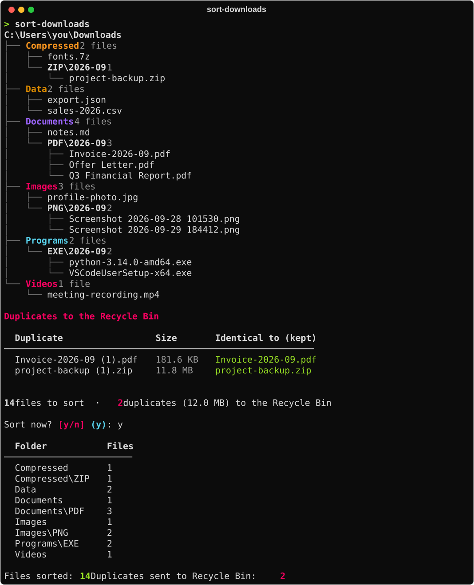

# Sort-Downloads

A small command-line tool that turns a messy Downloads folder into a tidy archive:
every loose file is filed as `Category\EXT\yyyy-MM\name.ext`, and exact duplicates
are sent to the Recycle Bin. You see a preview of every move before anything happens.



## How it files things

- **Category, then extension, then month.** `invoice.pdf` downloaded in September 2026
  ends up in `Documents\PDF\2026-09\`. Extensions not in the category table go to `Other`.
- **One-offs stay simple.** An extension with a single file sits loose in its category
  folder (`Programs\setup.exe`). When a second file of that extension arrives, both move
  into their own extension folder. An extension that already has a folder always uses it.
- **Filed files stay put.** Files already in a month folder are never moved again, and
  existing subfolders (extracted archives, portable apps, games) are left alone.
- **Duplicates are recycled, not deleted.** Files with identical content (same size and
  MD5) in the same folder are duplicates. A copy that's already filed is kept, otherwise
  the shortest name, then the oldest. The rest go to the Recycle Bin together in one
  `Duplicates <date time>` folder, so they can be restored in one go. Empty files are
  never treated as duplicates.
- **Nothing is overwritten.** A name clash becomes `name (2).ext`.
- **Safe to run anytime.** Partial downloads (`.crdownload`, `.part`, ...), hidden files
  and the tool's own files are skipped.

## Install

Requires Python 3.9+.

```powershell
pipx install git+https://github.com/Divyajeet7978/Sort-Downloads.git
```

or, without pipx, `pip install git+https://github.com/Divyajeet7978/Sort-Downloads.git`.

## Use

```powershell
sort-downloads              # preview, confirm, then sort your Downloads folder
sort-downloads --dry-run    # preview only, nothing is moved
sort-downloads --yes        # sort without asking
sort-downloads D:\Inbox     # sort a different folder
```

Prefer double-clicking? Put `sort_downloads.py` and `sort_downloads.cmd` in your Downloads
folder (after `pip install rich send2trash`) and run the `.cmd`.

## PowerShell version

The tool started as a zero-dependency PowerShell script, kept in [`powershell/`](powershell).
It follows the same rules without the interactive preview:

```powershell
.\Sort-Downloads.ps1 -WhatIf    # preview, nothing is moved or deleted
.\Sort-Downloads.ps1            # sort loose files
```

## Tests

```powershell
pip install -e ".[test]"
pytest
```

Besides unit tests for each rule, a parity test builds the same messy folder twice, sorts one
copy with the PowerShell script and the other with the Python version, and checks that both
end up identical.

## License

[MIT](LICENSE)
